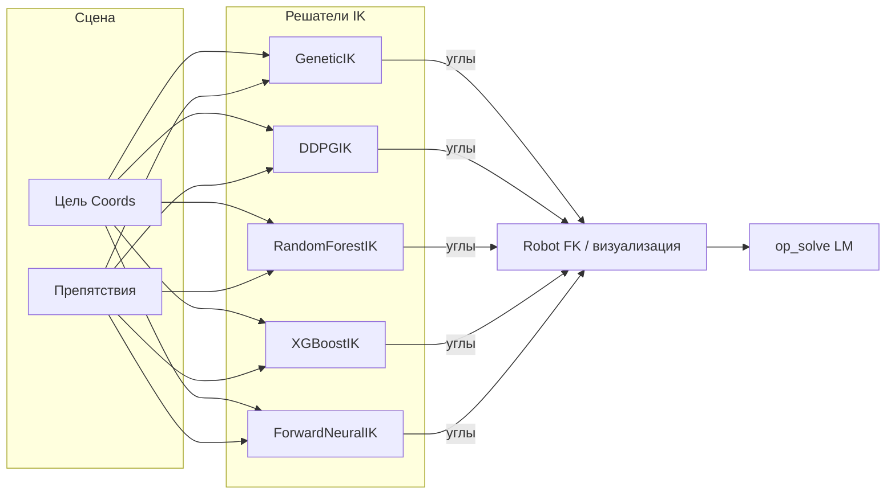

# rl-for-robots

**Обратная кинематика 7-DOF манипулятора** — от классической эвристики до RL и supervised ML: один `Robot`, несколько решателей, общие метрики, препятствия и визуализация.

---

## Зачем этот репозиторий

| Задача | Что внутри |
|--------|------------|
| Понять, как ведёт себя IK на одной сцене | [`examples/common.py`](examples/common.py) — DH, лимиты углов, цель, сферы |
| Обучить / сравнить методы | Genetic, **DDPG**, Random Forest, **XGBoost**, MLP |
| Прогнать честное сравнение | [`tests/test_ik_benchmark_table.py`](tests/test_ik_benchmark_table.py) — таблица MSE, ошибок FK, времени |
| Снять ролик для през | MP4 только с **3D-манипулятором** → `plots/*.mp4` |

---

## Стек

```
Python 3.10+ 
NumPy
Matplotlib
PyTorch (DDPG, MLP)
scikit-learn
XGBoost (деревья)
```

Полный список: [`requirements.txt`](requirements.txt).

---

## Установка

```bash
git clone <repo-url>
cd rl-for-robots
python -m venv .venv
source .venv/bin/activate 
pip install -r requirements.txt
```

---

## Быстрый старт

Все команды — **из корня** `rl-for-robots/`.

```bash
export MPLBACKEND=Agg   # headless / без всплывающих окон
```

### Примеры

| Команда | Результат |
|---------|-----------|
| `python examples/genetic_ik.py` | Genetic IK + кадры в `plots/genetic_frames/` + **`plots/genetic_approach.mp4`** |
| `python examples/ddpg_ik.py` | DDPG + **`plots/ddpg_training_curve.png`** + кадры + **`plots/ddpg_approach.mp4`** |
| `python examples/ml_xgb_ik.py` | XGBoost, датасет по сетке + **`plots/xgb_approach.mp4`** |
| `python examples/ml_rf_ik.py` | Random Forest IK |
| `python examples/ml_nn_ik.py` | MLP IK (PyTorch) |

Кинематика, цель и препятствия централизованы в [`examples/common.py`](examples/common.py). Подробнее — [`examples/README.md`](examples/README.md).

### Классические входы

```bash
python main.py          # Genetic + op_solve
python main_ddpg.py     # DDPG
```

---

## Архитектура (логика)



- **`robots/`** — DH, FK, `solve` → делегирует в текущий `ik_solver`, `visualize`, `op_solve`.
- **`control/IK/`** — все решатели + [`ml_dataset.py`](control/IK/ml_dataset.py) (X/y из FK), [`video_export.py`](control/IK/video_export.py) (сборка MP4 из PNG).
- **`control/core/`** — базовый генетический оптимизатор.
- **`examples/`** — воспроизводимые сценарии и `plots/` (git не обязан трекать — генерируется локально).

---

## Сравнение методов

| Метод | Идея | Когда заходит |
|-------|------|-----------------|
| **Genetic** | Популяция + мутации, штраф за препятствия и сглаживание по углам | Нужен работающий baseline без нейросети |
| **DDPG** | Online RL: состояние = углы + ошибка до цели, награда как у генетики | Есть torch, хочется policy под конкретную сцену |
| **RF / XGBoost** | Supervised: `(pose, R)` → углы с датасета FK | Много офлайн-сэмплов, быстрый инференс |
| **MLP** | То же, но нейросеть | GPU/батчи, гладкая аппроксимация |

Уточнение конфигурации после любого IK: **`robot.op_solve(angles, target, obstacles=...)`** (Levenberg–Marquardt).

---

## Тесты

```bash
pytest tests/ -q
```

---

## Структура репозитория

### Дерево проекта

```
rl-for-robots/
├── README.md                 # этот файл
├── requirements.txt          # зависимости pip
├── __init__.py               # пакет корня (пустой маркер)
│
├── main.py                   # сценарий: Genetic IK → визуализация → MP4 → op_solve
├── main_ddpg.py              # DDPG IK: обучение, график, визуализация, MP4
├── main_ddpg_tune.py         # перебор гиперпараметров DDPG (если нужен grid)
│
├── robots/
│   ├── robot.py              # Robot: DH FK, get_joint_positions, solve, visualize, op_solve
│   └── utils.py              # Coords, Obstacle, Sphere, Capsule, дистанции, 3D-примитивы
│
├── control/
│   ├── core/
│   │   └── genetic_base.py   # GeneticOptimizer: поколения, элита, early stopping, callback
│   │
│   ├── IK/
│   │   ├── ik_base.py        # базовый InverseKinematics
│   │   ├── genetic.py        # GeneticIK: фитнес, препятствия, кадры для MP4, tune()
│   │   ├── ddpg.py           # DDPGIK: actor-critic, буфер, награда как у генетики, чекпоинты
│   │   ├── decision_trees.py # RandomForestIK, XGBoostIK, датасет, learning curve, прогресс XGB→MP4
│   │   ├── nn.py             # ForwardNeuralIK: MLP, torch, train/solve
│   │   ├── ml_dataset.py     # sample_random_joint_configs, grid, build_xy_from_robot, метрики FK
│   │   └── video_export.py   # сборка MP4 из PNG (H.264, выравнивание размеров кадров)
│   │
│   └── TP/
│       └── genetic.py        # зарезервировано / заготовка (пока пусто)
│
├── examples/
│   ├── README.md             # таблица скриптов + бенчмарк-команда
│   ├── __init__.py
│   ├── common.py             # DH, ANGLE_LIMITS, DEFAULT_TARGET, препятствия, DDPG_TUNED_KWARGS, make_robot()
│   ├── genetic_ik.py         # Genetic + кадры + genetic_approach.mp4 + op_solve
│   ├── ddpg_ik.py            # DDPG + plots/ddpg_* (кривая, кадры, mp4)
│   ├── ml_rf_ik.py           # Random Forest: сетка датасета, train, solve
│   ├── ml_xgb_ik.py          # XGBoost: сетка, train с прогрессом деревьев → xgb_approach.mp4
│   └── ml_nn_ik.py           # MLP IK: сетка + случайные сэмплы, torch
│
├── tests/
│   ├── __init__.py
│   ├── ik_benchmark_utils.py   # DH/лимиты/цели для бенчмарка, FK-ошибки, штраф препятствий
│   ├── test_ik_benchmark_table.py  # сводная таблица Genetic / DDPG / RF / XGB / NN
│   └── test_genetic_ik_mean_error.py
│
├── checkpoints/              # не в git по умолчанию: *.pt, *.joblib (создаётся скриптами)
├── plots/                    # не в git по умолчанию: mp4, png, папки кадров (examples)
│
└── cosmic_stuff/
    └── robot.py              # сторонний/экспериментальный вариант робота (не основной API)
```


*Если репозиторий оказался полезен — звезда на GitHub или PR с улучшением бенчмарка сделают автора чуть счастливее.*
